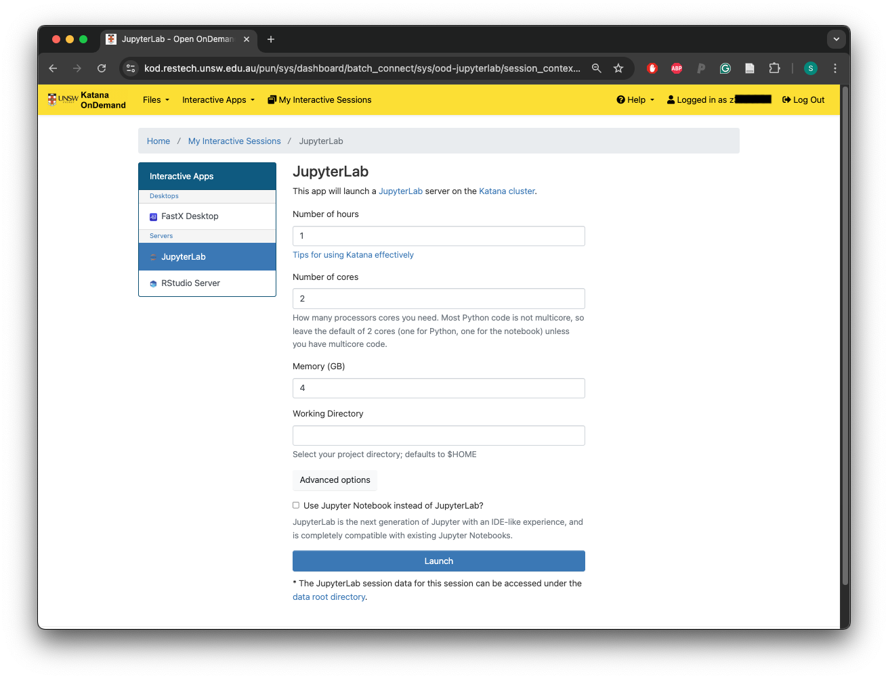
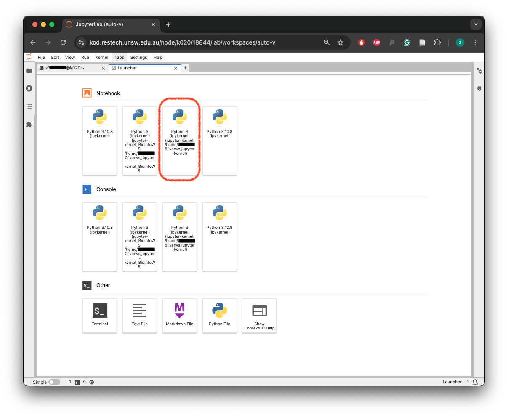
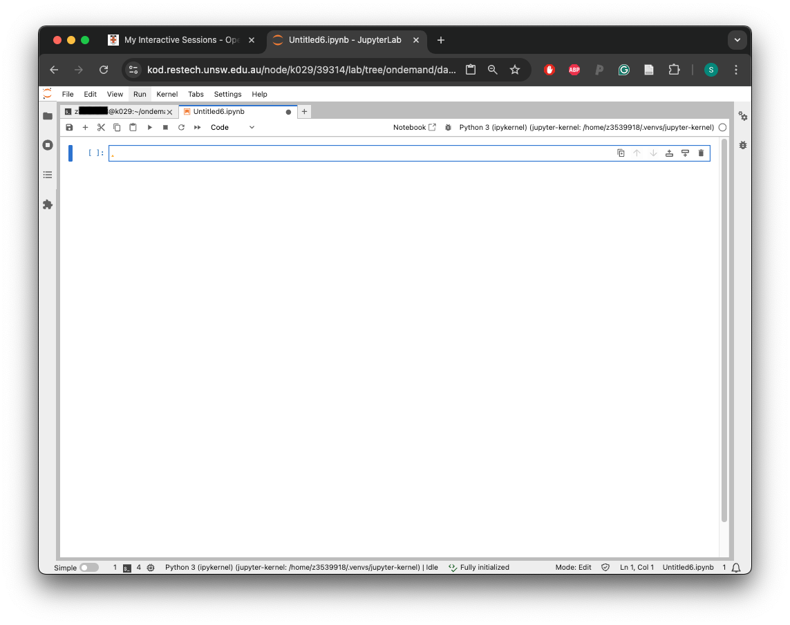
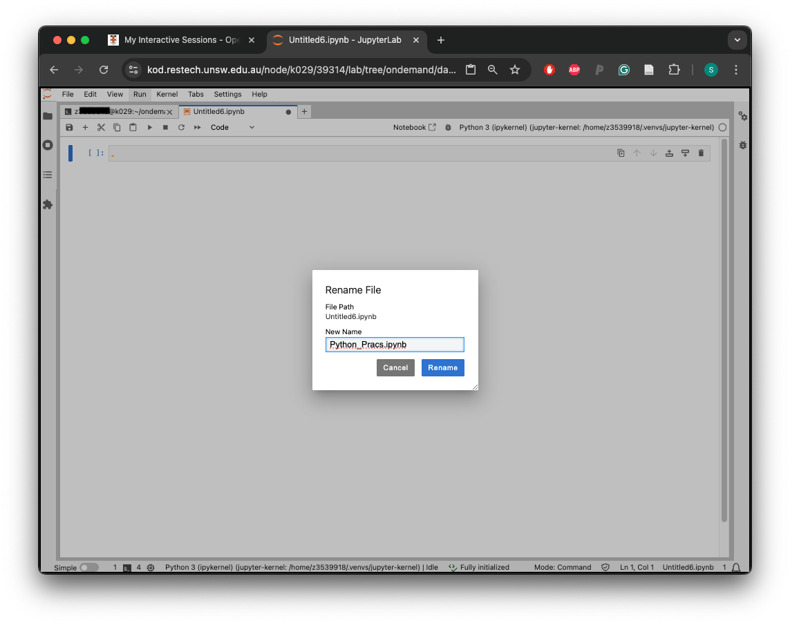

## Setting up your Python environment

We will again navigate to the [Katana OnDemand
Dashboard](https://kod.restech.unsw.edu.au/pun/sys/dashboard/).

We will click on 'Jupyter Lab'

You'll see a menu like this:

{alt=''}

Click on the blue button that says 'Launch'. 

The instance will say first 'Queued' and then 'Starting' in blue, 
click on the 'Connect to Jupyter' button once the status changes
to 'Running' in green. 

In this 'Launcher' screen we will find the submenu 'Others' and
we will click on 'Terminal'. This will take us to a terminal very
similar to the one we were using last week. 

We will execute the following commands one by one:

~~~ {.bash}
module load python/3.10.8
python3 -m venv --system-site-packages /home/z3539918/.venvs/jupyter-kernel
~~~

In the next command, which will create our 'kernel', 
please change 'your_zID' by your own zID:

~~~ {.bash}
source /home/your_zID/.venvs/jupyter-kernel/bin/activate
~~~

Finally, we will install a couple of packages that will be helpful for our lessons:

~~~ {.bash}
pip install ipykernel
install_jupyter_kernels
pip install numpy
pip install matplotlib
~~~

Once this is finished, we will click the '+' button on the top right corner of 
the Terminal. This will take us once again to the Launcher, where we will 
click on the Python 3 (ipykernel) we generated above, which should be called:

~~~ {.output}
/home/your_zID/.venvs/jupyter-kernel
~~~

{alt=''}

Which will open our first Jupyter notebook. 

{alt=''}

Please click with the right click on top of the name and rename the file 'Python_Prac.ipynb'
as follows:

{alt=''}

Finally, we will go back to our terminal to download some files with the
following commands:

~~~ {.bash}
cd /home/your_zID/ondemand/data/sys/dashboard/batch_connect/db/
wget https://liz-fernandez.github.io/Honours_Bioinfo_2024/DATA/python-novice-inflammation-data.zip
unzip python-novice-inflammation-data.zip
~~~

And finally, click back to our Jupyter notebook.

Now we are ready to start our lessons! 

